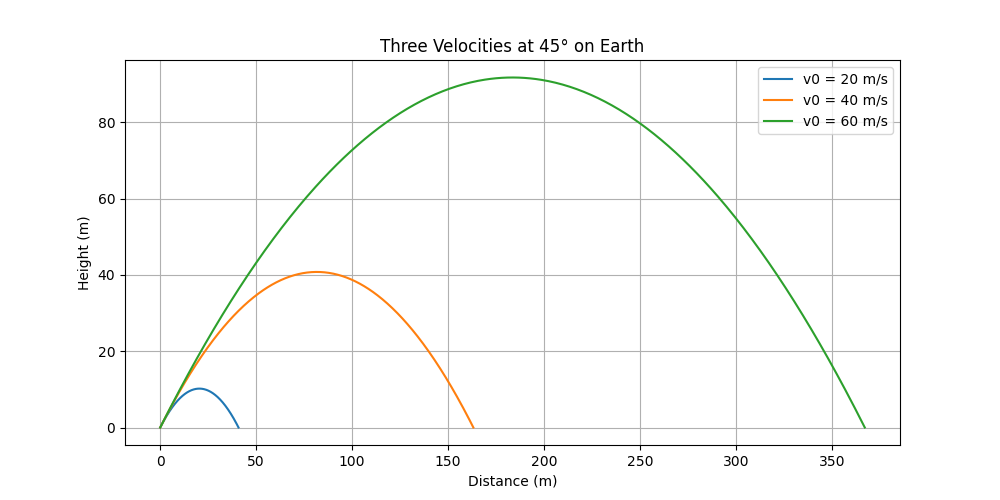
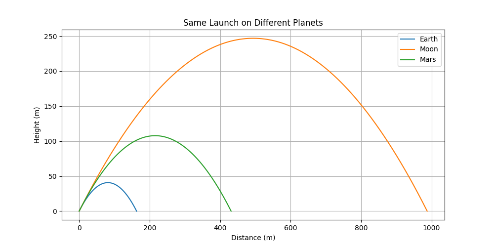
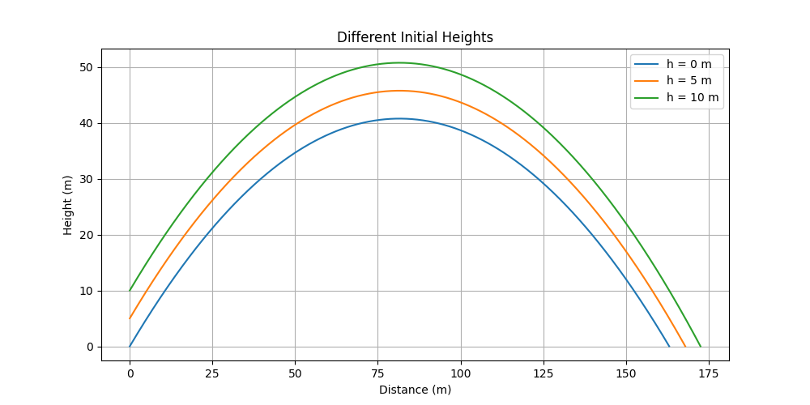
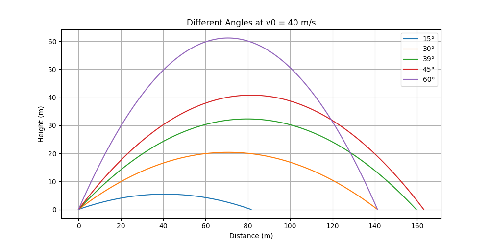
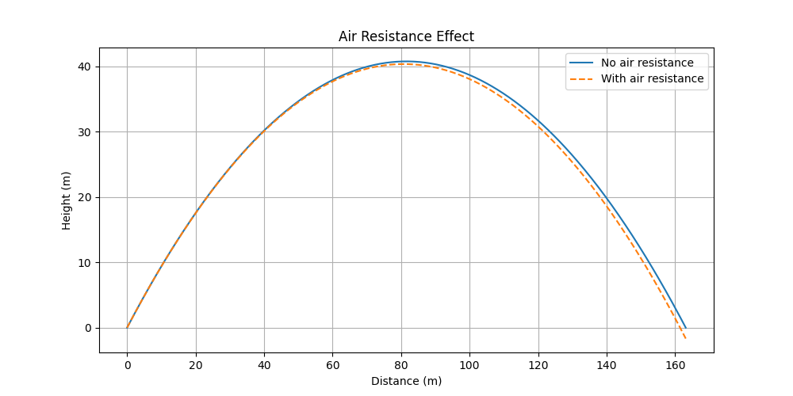

# Problem 1

.

---

# 🎯 Investigating the Range as a Function of the Angle of Projection

# Derivation of the General Solution from the Laws of Motion

We begin with Newton's Second Law of Motion:

$$
\vec{F} = m \vec{a}
$$

This implies that the net force acting on a body is equal to the mass of the body multiplied by its acceleration.

---

## 1. Motion in One Dimension

Consider motion along the x-axis with constant acceleration $a$.

From the definition of acceleration:

$$
a = \frac{dv}{dt}
$$

Integrating both sides with respect to time:

$$
\int a \, dt = \int \frac{dv}{dt} \, dt \Rightarrow at + C_1 = v(t)
$$

Letting $v_0$ be the initial velocity at $t = 0$, we find $C_1 = v_0$, so:

$$
v(t) = v_0 + at
$$

Now, velocity is the derivative of position:

$$
v = \frac{dx}{dt}
$$

Integrating again:

$$
\int v \, dt = \int (v_0 + at) \, dt = v_0 t + \frac{1}{2} a t^2 + C_2
$$

Letting $x_0$ be the initial position at $t = 0$, we find $C_2 = x_0$, giving the position function:

$$
x(t) = x_0 + v_0 t + \frac{1}{2} a t^2
$$

---

## 2. General Solution in Two Dimensions

We now extend the solution to two-dimensional motion with constant acceleration.

Let $\vec{r}(t) = (x(t), y(t))$, $\vec{v}(t) = (v_x(t), v_y(t))$, and $\vec{a} = (a_x, a_y)$.

Using the same integration steps for each component:

### Velocity components:

$$
v_x(t) = v_{0x} + a_x t
$$

$$
v_y(t) = v_{0y} + a_y t
$$

### Position components:

$$
x(t) = x_0 + v_{0x} t + \frac{1}{2} a_x t^2
$$

$$
y(t) = y_0 + v_{0y} t + \frac{1}{2} a_y t^2
$$

Thus, the general vector solution is:

$$
\vec{r}(t) = \vec{r}_0 + \vec{v}_0 t + \frac{1}{2} \vec{a} t^2
$$

where:

- $\vec{r}_0 = (x_0, y_0)$ is the initial position,
- $\vec{v}_0 = (v_{0x}, v_{0y})$ is the initial velocity,
- $\vec{a} = (a_x, a_y)$ is the constant acceleration.

This equation describes the position of a particle under constant acceleration in two-dimensional space.


---

## 2. Theoretical Foundation

### 🧮 Velocity Components:

- Horizontal: $v_{0x} = v_0 \cos(\theta)$
- Vertical: $v_{0y} = v_0 \sin(\theta)$

### ⏱️ Time of Flight:

$$
T = \frac{2 v_0 \sin(\theta)}{g}
$$

### 📏 Range:

$$
R = \frac{v_0^2 \sin(2\theta)}{g}
$$

- Maximum range occurs at $\theta = 45^\circ$
- Doubling $v_0$ quadruples the range

---

## 3. Graphical Analysis

### 📊 Plot 1: Range vs Angle for Different Velocities

This graph shows how the range changes with angle for $v_0 = 10, 20, 30 \, \text{m/s}$. All curves peak at $45^\circ$, confirming it as the optimal launch angle.



---

### 📊 Plot 2: Range vs Angle on Different Planets

Here, $v_0 = 20 \, \text{m/s}$ and we compare projectile ranges on **Earth**, **Moon**, and **Mars**. The lower the gravity, the longer the projectile stays in the air, resulting in greater range.



---

### 📊 Plot 3: Trajectories from Different Initial Heights

This graph uses a fixed angle ($\theta = 45^\circ$) and velocity ($v_0 = 20\, \text{m/s}$), but launches the projectile from various heights ($h = 0, 5, 10\, \text{m}$). As expected, higher launch points result in longer range and higher peak.





---

### 📊 Plot 4: Trajectories at Multiple Angles

Here we show the paths of projectiles launched at the same speed ($v_0 = 20\, \text{m/s}$) but with different angles: $15^\circ$, $39^\circ$, $45^\circ$, $60^\circ$, and $75^\circ$. It visually demonstrates how lower angles have flatter paths and shorter airtime.



---

### 📊 Plot 5: With vs Without Air Resistance

This comparison plot shows the difference in trajectories when air resistance is considered. While real drag modeling is complex, we simulate a simplified scenario showing that air resistance reduces both range and peak height.


---

## 4. Insights and Applications

- **45°** is the optimal angle for range under ideal (no air) conditions.
- **Air resistance** significantly shortens the range and reduces height.
- **Different planets** yield different results due to varying gravity.
- **Initial height** adds more airtime and therefore greater range.

These concepts are important in:
- Sports physics (kicking, throwing)
- Military ballistics
- Spacecraft launches
- Engineering simulations

---

## 5. Conclusion

With physics equations and computational tools, we effectively analyzed how a projectile behaves under various scenarios. Graphical analysis helped confirm theoretical expectations and made the results more intuitive.


##   Simulate It with Python

Here’s some Python code that calculates the range for different angles and plots

```python
import numpy as np
import matplotlib.pyplot as plt

# Gravity and initial speed
g = 9.81  # m/s^2
v0 = 20.0  # m/s

# Try angles from 0 to 90 degrees
angles_deg = np.linspace(0, 90, 100)
angles_rad = np.radians(angles_deg)

# Calculate the range for each angle
ranges = (v0 ** 2) * np.sin(2 * angles_rad) / g

# Plot it
plt.figure(figsize=(10, 6))
plt.plot(angles_deg, ranges)
plt.title("How Far Does It Go? Range vs Launch Angle")
plt.xlabel("Launch Angle (degrees)")
plt.ylabel("Range (meters)")
plt.grid(True)
plt.axvline(x=45, color='red', linestyle='--', label='Max Range at 45°')
plt.legend()
plt.tight_layout()
plt.show()
```


---

##  Final
- The **sweet spot** for distance is 45°—that’s when the projectile goes the farthest.
- The graph is symmetric: launching at 30° gives you the same range as 60°.
- If you increase the launch speed, the range increases a lot (since it’s based on $v_0^2$).

---

