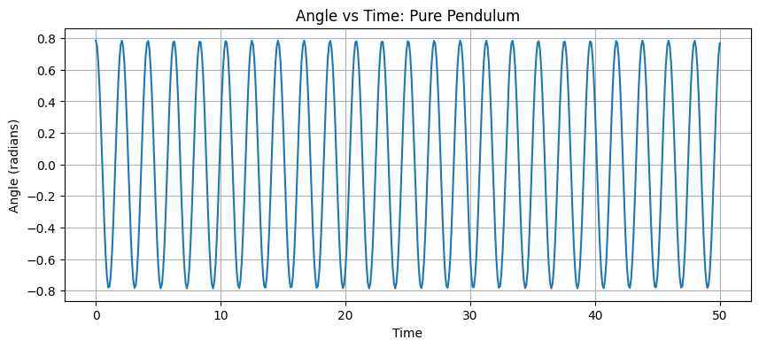
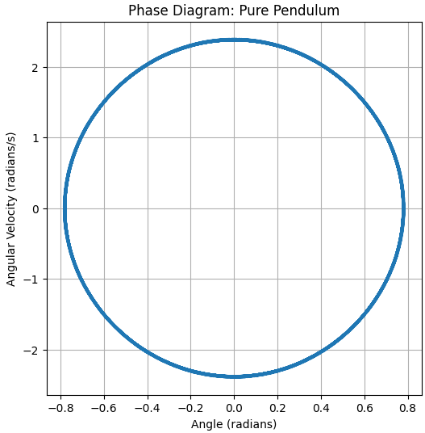
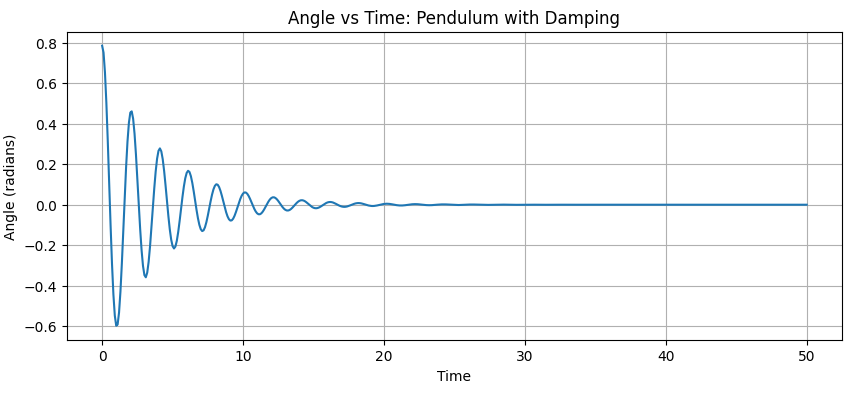
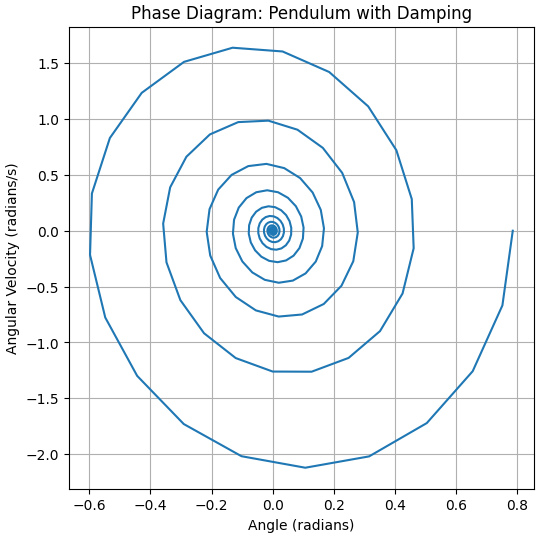
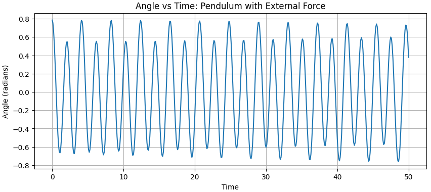
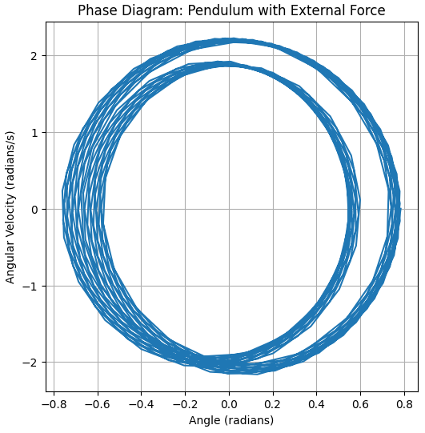
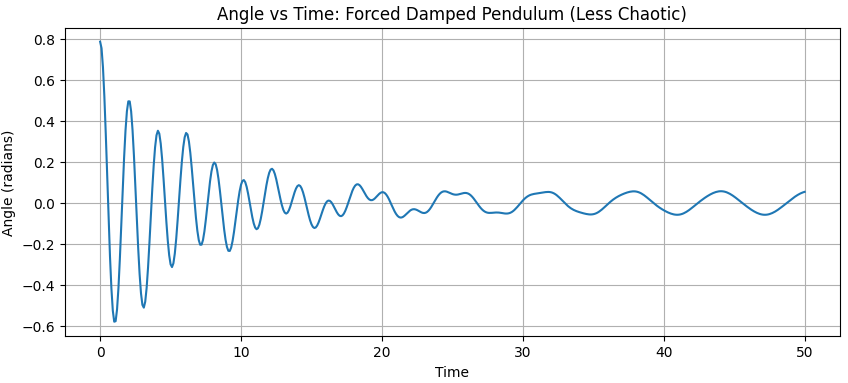
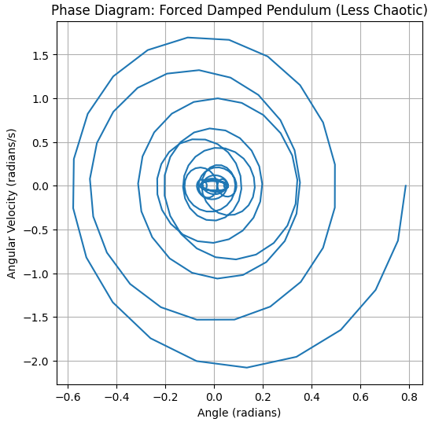
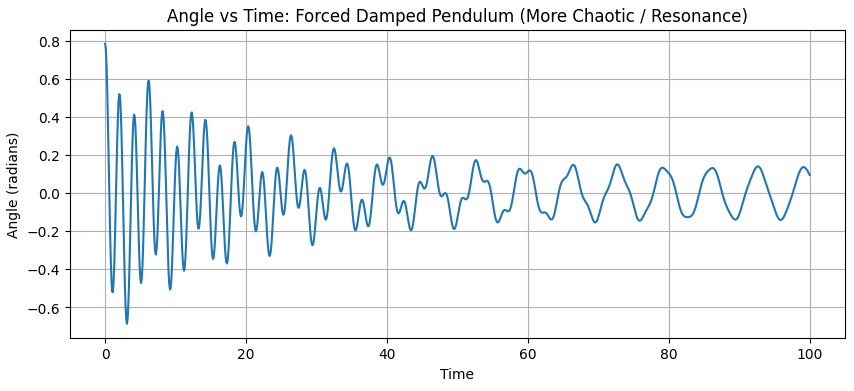
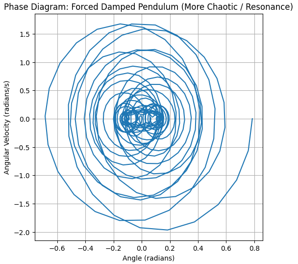

# Problem 2


# Example

Pendulum in physcics is a classic example of a system that exhibits periodic motion. A pendulum consists of a mass (the bob) attached to a string or rod that swings back and forth under the influence of gravity. The motion of the pendulum can be described by its period, which is the time it takes to complete one full swing, and its amplitude, which is the maximum distance from the equilibrium position.

# Colab

[Visit my colab page]https://colab.research.google.com/drive/1tXrcn0eyufzG0LCLXhvXq7w2YqxVh6Nt?usp=sharing

# Pendulum Example


```python
import numpy as np
import matplotlib.pyplot as plt
from scipy.integrate import solve_ivp

# Define the system of differential equations
def pendulum_ode(t, y, b, g, L, A, omega):
    theta, omega_angular = y
    dydt = [omega_angular,
            A * np.cos(omega * t) - b * omega_angular - (g / L) * np.sin(theta)]
    return dydt

# Set parameters (you can change these)
g = 9.81  # acceleration due to gravity
L = 1.0   # length of the pendulum
t_span = [0, 20] # time span for simulation
t_eval = np.linspace(t_span[0], t_span[1], 500) # points to evaluate the solution

# Initial conditions (angle, angular velocity)
initial_conditions = [np.pi / 4, 0] # Start at 45 degrees with zero initial velocity

# Pure pendulum (b=0, A=0)
b_pure = 0
A_pure = 0
omega_pure = 0

sol_pure = solve_ivp(pendulum_ode, t_span, initial_conditions, t_eval=t_eval, args=(b_pure, g, L, A_pure, omega_pure))

plt.figure(figsize=(12, 5))

plt.subplot(1, 2, 1)
plt.plot(sol_pure.t, sol_pure.y[0])
plt.xlabel("Time (t)")
plt.ylabel("Angle (radians)")
plt.title("Angle vs Time (Pure Pendulum)")
plt.grid(True)

plt.subplot(1, 2, 2)
plt.plot(sol_pure.y[0], sol_pure.y[1])
plt.xlabel("Angle (radians)")
plt.ylabel("Angular Velocity (radians/s)")
plt.title("Phase Diagram (Pure Pendulum)")
plt.grid(True)

plt.tight_layout()
plt.show()
```
# Scenario 1: Pure Pendulum (b=0, A=0)

This scenario represents the simplest case of a pendulum, where there is no damping (the resistance to motion due to friction or air resistance is zero, `b=0`) and no external force acting on the system (`A=0`). The motion is purely governed by gravity. We expect to see simple harmonic motion (or close to it for small angles) with a constant amplitude and period. The phase diagram should show a closed elliptical path.





# Scenario 2: Pendulum with Damping (b > 0, A=0)

In this scenario, we introduce damping to the pendulum (`b > 0`), while still having no external force (`A=0`). Damping causes the pendulum to lose energy over time, and its oscillations will gradually decrease in amplitude until it comes to rest at the equilibrium position (hanging straight down). The phase diagram should show a spiral path that converges towards the origin (0,0), representing the decrease in both angle and angular velocity.




# Scenario 3: Pendulum with External Force (b=0, A > 0)

Here, we examine a pendulum with an external periodic force applied (`A > 0`), but without any damping (`b=0`). The external force continuously adds energy to the system. Depending on the frequency of the external force (`omega`), the pendulum's motion can become quite complex and may not settle into a stable oscillation. The phase diagram may show irregular or complex patterns, not necessarily closed loops or simple spirals.



# Scenario 4: Forced Damped Pendulum (Less Chaotic)

This scenario combines both damping (`b > 0`) and an external force (`A > 0`). With moderate damping, the system tends to reach a steady state where the energy added by the external force is balanced by the energy dissipated by damping. The motion is typically oscillatory and predictable, though the exact pattern depends on the parameters. The phase diagram might show a limit cycle, which is a stable, closed trajectory that the system settles into after an initial transient period.




```python
import numpy as np
from scipy.integrate import odeint
import matplotlib.pyplot as plt

# Define the pendulum equation
def pendulum(y, t, b, g, l, A, omega):
    theta, omega_dot = y
    dydt = [omega_dot, -b * omega_dot - (g / l) * np.sin(theta) + A * np.cos(omega * t)]
    return dydt

# --- Scenario 5: Forced Damped Pendulum (More Chaotic / Resonance) ---
b = 0.1
A = 1.2
omega = 0.95 # Near resonance

# --- Common Parameters ---
g = 9.81  # acceleration due to gravity
l = 1.0   # length of the pendulum
y0 = [np.pi / 4, 0.0]  # initial conditions (angle, angular velocity)
t = np.linspace(0, 100, 1001) # time points (extended for chaos)

# Solve the differential equation
sol = odeint(pendulum, y0, t, args=(b, g, l, A, omega))
angle = sol[:, 0]
angular_velocity = sol[:, 1]

# Plot Angle vs. Time
plt.figure(figsize=(10, 4))
plt.plot(t, angle)
plt.xlabel('Time')
plt.ylabel('Angle (radians)')
plt.title('Angle vs Time: Forced Damped Pendulum (More Chaotic / Resonance)')
plt.grid(True)
plt.show()

# Plot Phase Diagram (Angle vs. Angular Velocity)
plt.figure(figsize=(6, 6))
plt.plot(angle, angular_velocity)
plt.xlabel('Angle (radians)')
plt.ylabel('Angular Velocity (radians/s)')
plt.title('Phase Diagram: Forced Damped Pendulum (More Chaotic / Resonance)')
plt.grid(True)
plt.show()
```
# Scenario 5: Forced Damped Pendulum (More Chaotic / Resonance)

This scenario also involves a forced damped pendulum, but with parameters set to potentially exhibit chaotic behavior. This often occurs when the damping is relatively low and the external force is significant, especially if the frequency of the external force (`omega`) is close to the natural frequency of the pendulum (resonance). In a chaotic system, even tiny changes in initial conditions can lead to vastly different outcomes over time, and the motion is aperiodic and unpredictable in the long term. The phase diagram in a chaotic system will not settle into a simple limit cycle and can show complex, fractal-like structures (a strange attractor).



