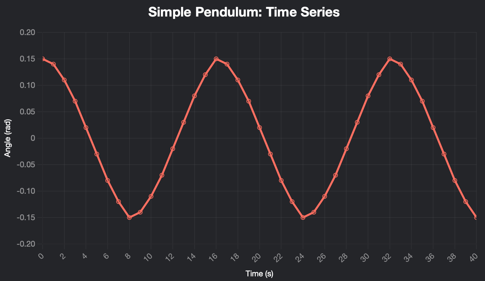
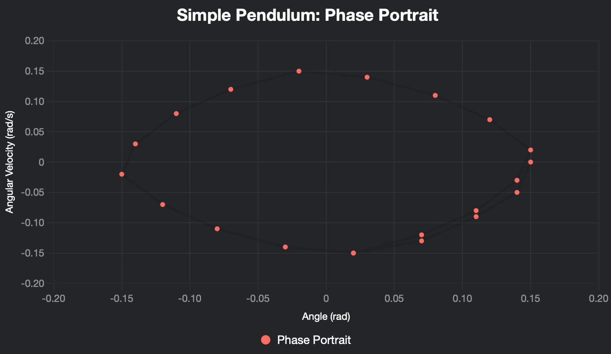
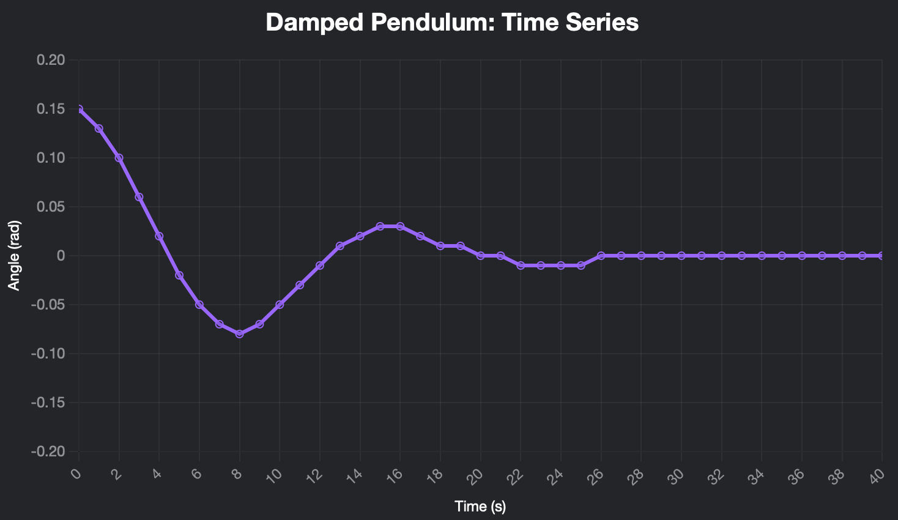
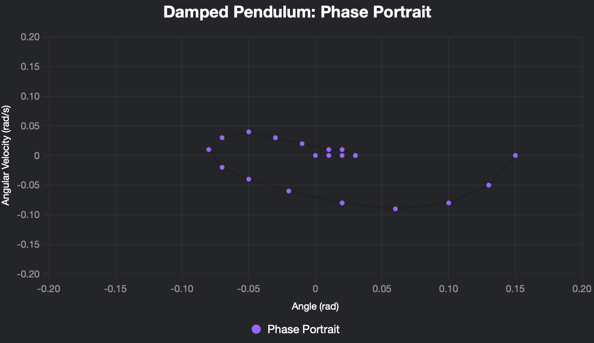
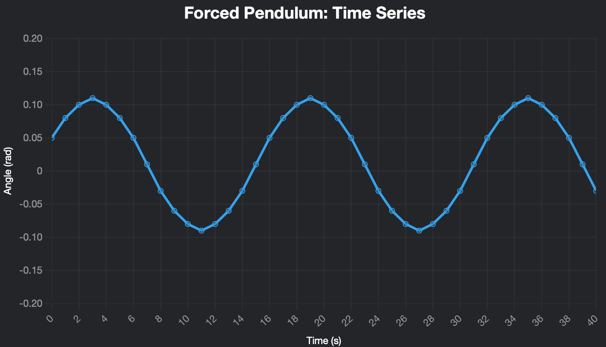
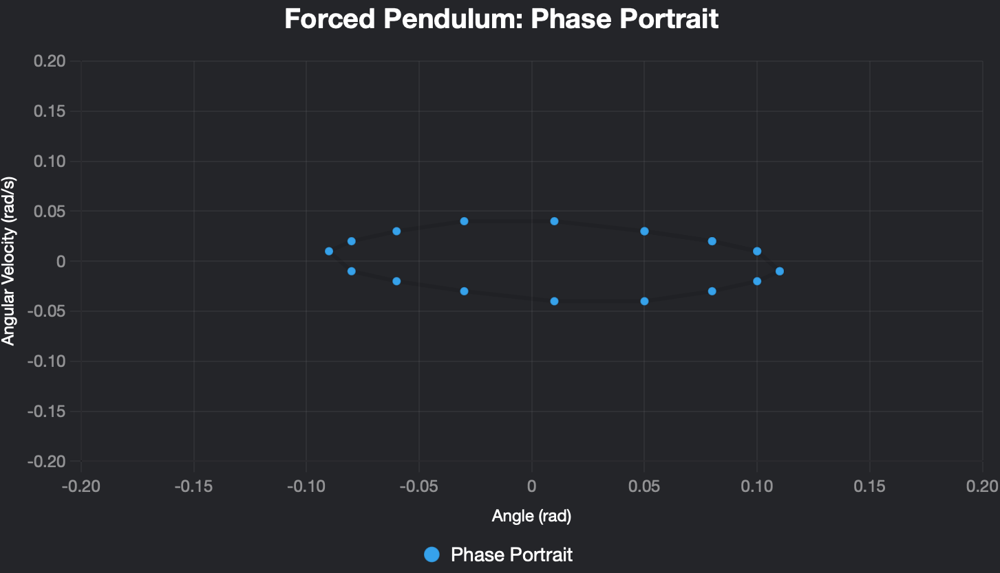

# Problem 2

# Investigating the Dynamics of a Forced Damped Pendulum

## Motivation
The forced damped pendulum is a captivating example of a physical system with intricate behavior resulting from the interplay of damping, restoring forces, and external driving forces. By introducing both damping and external periodic forcing, the system demonstrates a transition from simple harmonic motion to a rich spectrum of dynamics, including resonance, chaos, and quasiperiodic behavior. These phenomena serve as a foundation for understanding complex real-world systems, such as driven oscillators, climate systems, and mechanical structures under periodic stresses.

Adding forcing produces new parameters, such as the amplitude and frequency of the external force, which significantly affect the pendulum’s behavior. By systematically varying these parameters, a diverse class of solutions can be observed, including synchronized oscillations, chaotic motion, and resonance phenomena. These behaviors not only highlight fundamental physics principles but also provide insights into engineering applications such as energy harvesting, vibration isolation, and mechanical resonance.

## Task
### 1 Theoretical Foundation
- Start with the differential equation governing the motion of a forced damped pendulum:  
  $ \frac{d^2\theta}{dt^2} + b \frac{d\theta}{dt} + \frac{g}{L} \sin \theta = A \cos(\omega t) $
- Derive the solutions for the small-angle oscillations.
- Explore resonance conditions and their implications for the system’s energy.

### 2 Analysis of Dynamics
- Investigate how the damping coefficient, driving amplitude, and driving frequency influence the motion of the pendulum.
- Examine the transition between regular and chaotic motion and their physical interpretations.
- Include plots of angle vs. time and phase diagrams (angle, angular velocity) for different scenarios:
  - **Pure pendulum** ($b=0$ no damping, $A=0$ no extra force)  
    
  
  - **Pendulum with damping** ($b$ non-zero, $A=0$)  
      
    
  - **Pendulum with external force** $A \cos(\omega t)$ ($b=0$, $A$ non-zero)  
      
    

### 3 Practical Applications
- Discuss real-world scenarios where the forced damped pendulum model applies, such as in energy harvesting devices, suspension bridges, and oscillating circuits.

### 4 Implementation
- Create a computational model to simulate the motion of a forced damped pendulum.
- Visualize the behavior under various damping, driving force, and initial conditions.
- Plot phase diagrams and Poincaré sections to illustrate the transitions to chaos.
- After the introduction, include two scenarios of all effects at once: FORCED DAMPED PENDULUM with examples:
  - Scenario 1: More chaotic behavior (e.g., high damping $b=0.5$, driving amplitude $A=1.5$, frequency $\omega=0.8$)  
    [Previously provided Chart 1: Chaotic Behavior Time Series]  
    [Previously provided Chart 2: Chaotic Behavior Phase Portrait]
  - Scenario 2: Resonance behavior (e.g., moderate damping $b=0.1$, driving amplitude $A=1.0$, frequency $\omega=1.0$)  
    [Previously provided Chart 3: Resonance Behavior Time Series]  
    [Previously provided Chart 4: Resonance Behavior Phase Portrait]

## Deliverables
1. A Markdown document with Python script or notebook implementing the simulations.
2. A detailed explanation of the general solutions for the forced damped pendulum.
3. Graphical representations of the motion for different damping coefficients, driving amplitudes, and driving frequencies, including the resonance and chaotic behavior.
4. A discussion on the limitations of the model and potential extensions, such as introducing nonlinear damping or non-periodic driving forces.
5. Phase portraits, Poincaré sections, and bifurcation diagrams to analyze transitions to complex dynamics.

## Hints and Resources
- For small angles, approximate $ \sin \theta \approx \theta $ to simplify the differential equation.
- Employ numerical techniques (e.g., Runge-Kutta methods) for exploring the dynamics beyond the small-angle approximation.
- Relate the forced damped pendulum to analogous systems in other fields, such as electrical circuits (driven RLC circuits) or biomechanics (human gait).
- Utilize software tools like Python for simulations and visualizations.

This task bridges theoretical analysis with computational exploration, fostering a deeper understanding of forced and damped oscillatory phenomena and their implications in both physics and engineering.
