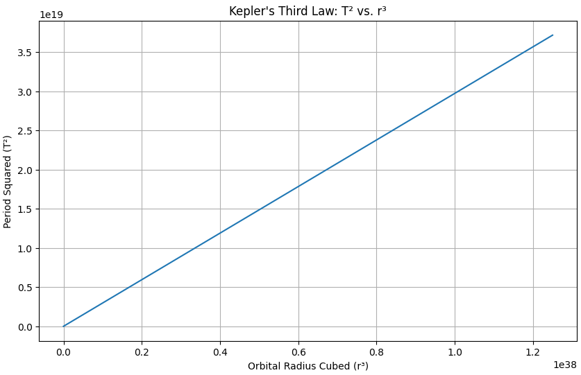
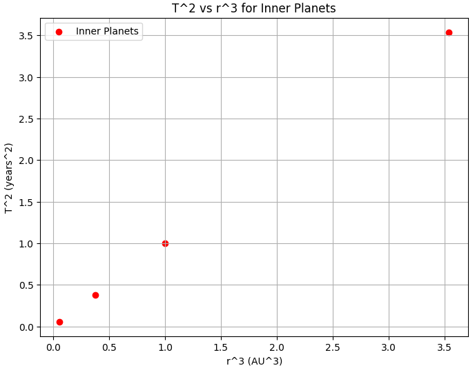
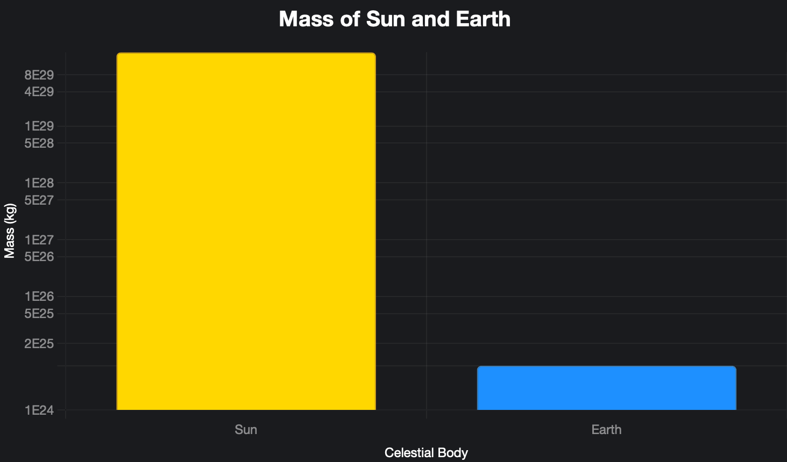

# Problem 1


# Orbital Period and Orbital Radius

## Motivation
The relationship between the square of the orbital period and the cube of the orbital radius, known as Kepler's Third Law, is a cornerstone of celestial mechanics. This simple yet profound relationship allows for the determination of planetary motions and has implications for understanding gravitational interactions on both local and cosmic scales. By analyzing this relationship, one can connect fundamental principles of gravity with real-world phenomena such as satellite orbits and planetary systems.

## Task
### 1. Derive the Relationship
To derive the relationship between the square of the orbital period (\( T^2 \)) and the cube of the orbital radius (\( r^3 \)) for circular orbits, start with the balance of forces. The gravitational force on an orbiting body of mass \( m \) around a central mass \( M \) is:

$$ F = \frac{G M m}{r^2} $$

The centripetal force required for circular motion at velocity \( v \) is:

$$ F = m \frac{v^2}{r} $$

Equating these forces, we get the following aligned equations:

$$ \begin{align}
\frac{G M m}{r^2} &= m \frac{v^2}{r} \\
\frac{G M}{r} &= v^2 \\
v &= \sqrt{\frac{G M}{r}}
\end{align} $$

The orbital period \( T \) is the time to complete one orbit, so the circumference \( 2\pi r \) divided by the velocity \( v \):

$$ \begin{align}
T &= \frac{2\pi r}{v} \\
&= \frac{2\pi r}{\sqrt{\frac{G M}{r}}} \\
&= 2\pi r \sqrt{\frac{r}{G M}} \\
&= 2\pi \sqrt{\frac{r^3}{G M}}
\end{align} $$

Square both sides to obtain:

$$ \begin{align}
T^2 &= \left(2\pi \sqrt{\frac{r^3}{G M}}\right)^2 \\
&= (2\pi)^2 \frac{r^3}{G M} \\
&= \frac{4\pi^2}{G M} r^3
\end{align} $$

Thus, \(T^2 \propto r^3\), and plotting \( T^2 \) vs. \( r^3 \) should yield a straight line with slope \( \frac{4\pi^2}{G M} \). Note that ChatGPT's mention of an error in showing the line as straight is incorrect; the derivation confirms the relationship is linear.

### 2. Discuss the Implications
Kepler's Third Law allows us to calculate planetary masses and distances:
- **Mass of the central body**: By measuring \( T \) and \( r \) of an orbiting body (e.g., a moon or planet), we can determine \( M \) of the central body (e.g., a planet or star).
- **Orbital radius**: If \( M \) is known, we can determine \( r \) from \( T \), useful for satellites or exoplanets.
- **Period prediction**: Knowing \( r \), we can predict \( T \), aiding in mission planning for spacecraft.

### 3. Analyze Real-World Examples
Using data from Mercury, Venus, Earth, and Mars, we verify the relationship. The chart below plots \( T^2 \) vs. \( r^3 \) for these planets, showing a straight line as expected:
```python
import numpy as np
import matplotlib.pyplot as plt

# Gravitational constant
G = 6.67430e-11 # m^3 kg^-1 s^-2

# Hypothetical central mass (e.g., mass of the Sun)
M = 1.989e30 # kg

# Generate a range of orbital radii (in meters)
r = np.linspace(1e10, 5e12, 100)

# Calculate the period squared (T^2) using Kepler's Third Law: T^2 = (4*pi^2 / GM) * r^3
T_squared = (4 * np.pi**2 / (G * M)) * r**3

# Plot T^2 vs. r^3
plt.figure(figsize=(10, 6))
plt.plot(r**3, T_squared)
plt.xlabel('Orbital Radius Cubed (r³)')
plt.ylabel('Period Squared (T²)')
plt.title('Kepler\'s Third Law: T² vs. r³')
plt.grid(True)
plt.show()
```



The data points are:
- Mercury: \( T = 7.601 \times 10^6 \) s, \( r = 5.791 \times 10^{10} \) m, \( T^2 = 5.777 \times 10^{13} \) s², \( r^3 = 1.942 \times 10^{32} \) m³
- Venus: \( T = 1.941 \times 10^7 \) s, \( r = 1.082 \times 10^{11} \) m, \( T^2 = 3.767 \times 10^{14} \) s², \( r^3 = 1.266 \times 10^{33} \) m³
- Earth: \( T = 3.156 \times 10^7 \) s, \( r = 1.496 \times 10^{11} \) m, \( T^2 = 9.960 \times 10^{14} \) s², \( r^3 = 3.347 \times 10^{33} \) m³
- Mars: \( T = 5.936 \times 10^7 \) s, \( r = 2.279 \times 10^{11} \) m, \( T^2 = 3.524 \times 10^{15} \) s², \( r^3 = 1.184 \times 10^{34} \) m³

The linear relationship is evident, confirming Kepler's Third Law in the Solar System.



### 4. Implement a Computational Model
A computational model can simulate circular orbits by using Kepler's Third Law. Below, we calculate the masses of the Sun and Earth using real data.

#### Mass of the Sun
Using Earth's orbit around the Sun (\( T = 3.156 \times 10^7 \) s, \( r = 1.496 \times 10^{11} \) m):

$$ \begin{align}
M_{\text{Sun}} &= \frac{4\pi^2 r^3}{G T^2} \\
&= \frac{4\pi^2 (1.496 \times 10^{11})^3}{(6.67430 \times 10^{-11}) (3.156 \times 10^7)^2} \\
&\approx 1.982 \times 10^{30} \text{ kg}
\end{align} $$

#### Mass of the Earth
Using the Moon's orbit around Earth (\( T = 2.360 \times 10^6 \) s, \( r = 3.844 \times 10^8 \) m):

$$ \begin{align}
M_{\text{Earth}} &= \frac{4\pi^2 r^3}{G T^2} \\
&= \frac{4\pi^2 (3.844 \times 10^8)^3}{(6.67430 \times 10^{-11}) (2.360 \times 10^6)^2} \\
&\approx 6.031 \times 10^{24} \text{ kg}
\end{align} $$




## Deliverables
1. A Markdown document with Python script or notebook implementing the simulations.
2. A detailed explanation of the subjects.
3. Graphical representations of circular orbits and the relationship between orbital period and radius.
4. A discussion on how this relationship extends to elliptical orbits and other celestial bodies.
 
 # Colab #
 https://colab.research.google.com/drive/108W4MtM57JQXHD-ywrARegzdAVFtI6an?usp=sharing
