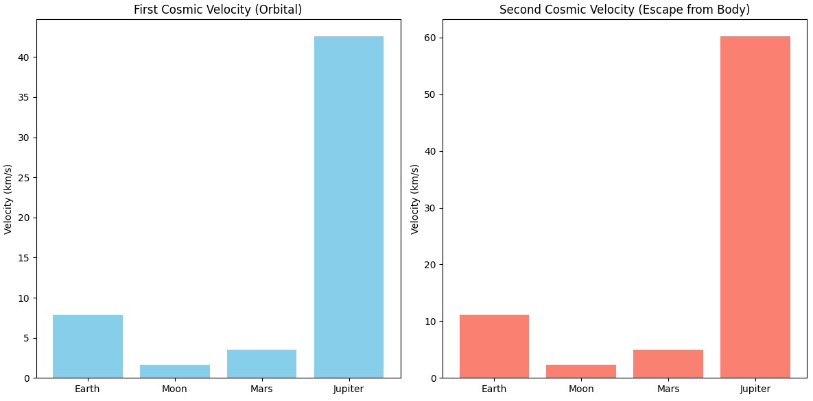
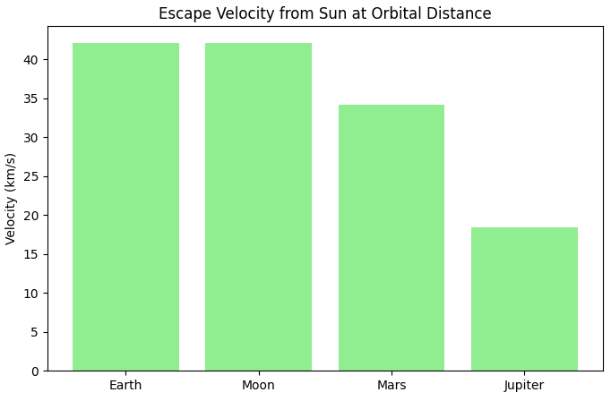
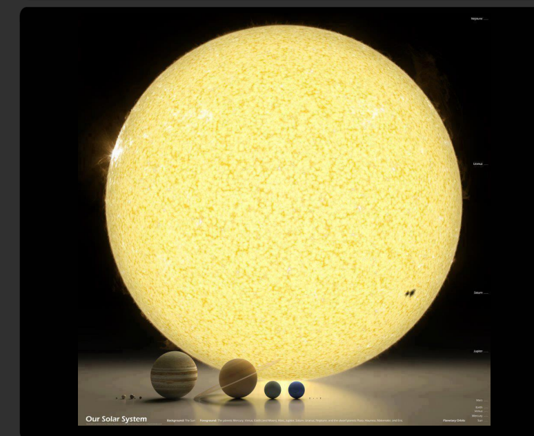

# Problem 2
# Problem 2: Escape Velocities and Cosmic Velocities


The concept of escape velocity is crucial for understanding the conditions required to leave a celestial body's gravitational influence. Extending this concept, the first, second, and third cosmic velocities define the thresholds for orbiting, escaping, and leaving a star system. These principles underpin modern space exploration, from launching satellites to interplanetary missions.

## Solution

### 1. Definitions of Cosmic Velocities

- **First Cosmic Velocity ($v_1$)**: This is the minimum speed needed for an object to orbit a celestial body at its surface, assuming no atmospheric drag. It is also called the circular orbital velocity. For a body of mass $M$ and radius $R$, it is given by $v_1 = \sqrt{\frac{GM}{R}}$, where $G$ is the gravitational constant ($G = 6.67430 \times 10^{-11} \, \text{m}^3 \text{kg}^{-1} \text{s}^{-2}$).

- **Second Cosmic Velocity ($v_2$)**: Known as the escape velocity, this is the minimum speed required for an object to escape the gravitational pull of a celestial body and not return. It is given by $v_2 = \sqrt{\frac{2GM}{R}} = \sqrt{2} \cdot v_1$.

- **Third Cosmic Velocity ($v_3$)**: This is the speed required for an object to escape the gravitational influence of a star system (e.g., the Solar System) entirely, assuming it starts from the orbit of a planet like Earth. It depends on the distance from the star and the planet’s orbital velocity. A simplified approximation for an object escaping the Sun from Earth's orbit is $v_3 \approx \sqrt{2} \cdot v_{\text{orbit}}$, where $v_{\text{orbit}}$ is Earth's orbital speed around the Sun.

### 2. Mathematical Derivations and Parameters

The derivations for these velocities stem from energy conservation and gravitational physics:

- **First Cosmic Velocity ($v_1$)**: For a circular orbit, the centripetal force equals the gravitational force: $\frac{m v_1^2}{R} = \frac{G M m}{R^2}$, simplifying to $v_1 = \sqrt{\frac{GM}{R}}$. Key parameters are $G$, $M$, and $R$.

- **Second Cosmic Velocity ($v_2$)**: To escape, the total mechanical energy must be zero: kinetic energy $\frac{1}{2} m v_2^2$ equals the potential energy $\frac{G M m}{R}$, so $\frac{1}{2} m v_2^2 = \frac{G M m}{R}$, yielding $v_2 = \sqrt{\frac{2 G M}{R}}$.

- **Third Cosmic Velocity ($v_3$)**: This involves escaping the Sun’s gravity from Earth’s orbit. Earth’s orbital speed around the Sun is $v_{\text{orbit}} = \sqrt{\frac{G M_{\text{Sun}}}{r}}$, where $r$ is the distance from the Sun (e.g., 1 AU for Earth). The escape velocity from the Sun at this distance is $\sqrt{\frac{2 G M_{\text{Sun}}}{r}}$. The third cosmic velocity is the additional speed needed beyond Earth’s orbital speed, approximated as $v_3 = \sqrt{\frac{2 G M_{\text{Sun}}}{r}}$ if starting from rest relative to the Sun, but adjusted for Earth’s motion.

Parameters affecting these velocities include the mass of the celestial body ($M$), its radius ($R$), and, for $v_3$, the distance from the star ($r$).




***Cosmic Velocities for Earth:***

First Cosmic Velocity (v1): 7.91 km/s (Orbital velocity just above surface)

Second Cosmic Velocity (v2): 11.19 km/s (Escape velocity from Earth's surface)

Escape Velocity from Sun at Earth's orbit: 42.13 km/s

### 3. Calculations and Visualization

Let’s calculate these velocities for Earth, Mars, and Jupiter using the following data:

- **Earth**: $M = 5.972 \times 10^{24} \, \text{kg}$, $R = 6.371 \times 10^6 \, \text{m}$.
- **Mars**: $M = 6.417 \times 10^{23} \, \text{kg}$, $R = 3.390 \times 10^6 \, \text{m}$.
- **Jupiter**: $M = 1.898 \times 10^{27} \, \text{kg}$, $R = 6.991 \times 10^7 \, \text{m}$.
- **Sun** (for $v_3$ from Earth’s orbit): $M_{\text{Sun}} = 1.989 \times 10^{30} \, \text{kg}$, $r = 1.496 \times 10^{11} \, \text{m}$ (1 AU).




#### Python Script for Calculations

```python
import numpy as np
import matplotlib.pyplot as plt

# Constants
G = 6.67430e-11  # Gravitational constant (m^3 kg^-1 s^-2)

# Celestial body data
bodies = {
    'Earth': {'mass': 5.972e24, 'radius': 6.371e6},
    'Mars': {'mass': 6.417e23, 'radius': 3.390e6},
    'Jupiter': {'mass': 1.898e27, 'radius': 6.991e7}
}
sun_mass = 1.989e30  # Sun's mass (kg)
earth_sun_distance = 1.496e11  # 1 AU (m)

# Calculate velocities
v1, v2, v3 = [], [], []
labels = []
for body, data in bodies.items():
    M = data['mass']
    R = data['radius']
    
    # First cosmic velocity
    v1.append(np.sqrt(G * M / R) / 1000)  # Convert to km/s
    
    # Second cosmic velocity
    v2.append(np.sqrt(2 * G * M / R) / 1000)  # Convert to km/s
    
    # Third cosmic velocity (approximation from Earth's orbit around Sun)
    if body == 'Earth':
        v_sun_escape = np.sqrt(2 * G * sun_mass / earth_sun_distance) / 1000  # km/s
        v_orbit = np.sqrt(G * sun_mass / earth_sun_distance) / 1000  # km/s
        v3.append(v_sun_escape)  # Simplified: total escape speed from Sun
    else:
        v3.append(None)  # Only calculate v3 for Earth in this example
    
    labels.append(body)

# Plotting (you can run this in a Jupyter notebook)
plt.figure(figsize=(10, 6))
width = 0.25
x = np.arange(len(labels))

plt.bar(x - width, v1, width, label='First Cosmic Velocity (v1)', color='#1E90FF')
plt.bar(x, v2, width, label='Second Cosmic Velocity (v2)', color='#FFD700')
plt.bar(x + width, [v3[0], 0, 0], width, label='Third Cosmic Velocity (v3, Earth only)', color='#FF4500')

plt.xlabel('Celestial Body')
plt.ylabel('Velocity (km/s)')
plt.title('Cosmic Velocities for Earth, Mars, and Jupiter')
plt.xticks(x, labels)
plt.legend()
plt.grid(True)
plt.show()
```
# Colab #
[Colab Link](https://colab.research.google.com/drive/17pPFY4rrF_9EhONsXk9cY9g4G8dPIlM8?usp=sharing)