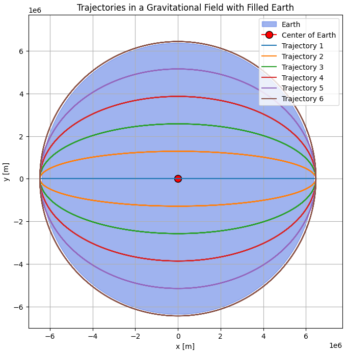
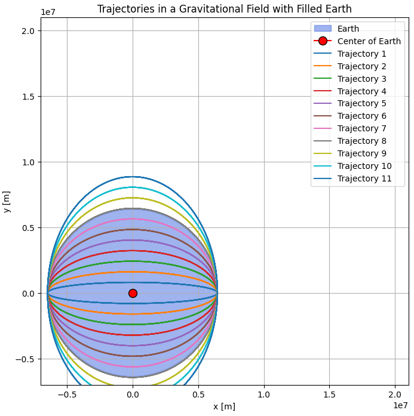

# Problem 3
# Payload Trajectories Near Earth

When a payload is released from a rocket near Earth, its path is governed by Newtonian gravity and initial conditions such as velocity, direction, and altitude. This document explores the types of trajectories possible—elliptical, parabolic, or hyperbolic—and simulates them using numerical integration.

## Physical Background

The gravitational force acting on a payload of mass $m$ due to the Earth (mass $M$) is given by Newton’s Law of Gravitation:

$$
\vec{F}_g = - \frac{G M m}{r^2} \hat{r}
$$

where:
- $G = 6.67430 \times 10^{-11} \ \text{m}^3\text{kg}^{-1}\text{s}^{-2}$ is the gravitational constant,
- $r$ is the distance from the center of the Earth,
- $\hat{r}$ is the unit vector pointing from the object to the Earth.

The motion of the payload can be determined by solving Newton's second law:

$$
\vec{a} = \frac{\vec{F}_g}{m} = - \frac{G M}{r^2} \hat{r}
$$

## Initial Conditions

- **Altitude**: 800 km above Earth's surface
- **Earth radius**: $R_E = 6371$ km
- **Initial position**: $\vec{r}_0 = (R_E + 800, 0)$ km
- **Initial velocities**: 5 to 13 km/s in the tangential (positive y) direction

## Trajectory Types

- **Elliptical orbit**: $v < v_{\text{escape}}$
- **Parabolic escape**: $v = v_{\text{escape}}$
- **Hyperbolic escape**: $v > v_{\text{escape}}$

Escape velocity from a distance $r$ is:

$$
v_{\text{escape}} = \sqrt{\frac{2 G M}{r}}
$$
 



## Python Simulation

The following Python code numerically integrates the motion using the Runge-Kutta method and plots the trajectory for various initial velocities. Earth is represented as a blue circle on the plot.

```python
import numpy as np
import matplotlib.pyplot as plt
from scipy.integrate import solve_ivp

# Constants
G = 6.67430e-11  # gravitational constant, m^3/kg/s^2
M = 5.972e24     # mass of Earth, kg
R = 6.371e6      # radius of Earth, m
rho = M / ((4/3) * np.pi * R**3)  # average density of Earth

def gravity_inside_earth(x, y):
    r = np.sqrt(x**2 + y**2)
    if r == 0:
        return 0, 0
    g = -G * (4/3) * np.pi * rho * r
    return g * x / r, g * y / r

def trajectory(t, state):
    x, y, vx, vy = state
    gx, gy = gravity_inside_earth(x, y)
    return [vx, vy, gx, gy]

# Initial conditions
def generate_initial_conditions(case=1):
    if case == 1:
        speeds = np.linspace(0, 8000, 6)  # m/s
        pos = [R + 1e5, 0]
    else:
        speeds = np.linspace(1000, 11000, 11)
        pos = [R + 1e5, 0]
    return speeds, pos

def simulate_trajectories(case=1):
    speeds, pos = generate_initial_conditions(case)
    t_span = (0, 20000)
    t_eval = np.linspace(*t_span, 1000)

    fig, ax = plt.subplots(figsize=(8, 8))
    ax.set_title(f'Trajectories in a Gravitational Field with Filled Earth')
    ax.set_xlabel('x [m]')
    ax.set_ylabel('y [m]')
    ax.set_aspect('equal')

    # Earth
    earth = plt.Circle((0, 0), R, color='royalblue', alpha=0.5, label='Earth')
    ax.add_artist(earth)
    ax.plot(0, 0, marker='o', color='red', markersize=10, label='Center of Earth', markeredgecolor='black')


    for i, speed in enumerate(speeds):
        vx, vy = 0, speed
        sol = solve_ivp(trajectory, t_span, [pos[0], pos[1], vx, vy], t_eval=t_eval)
        ax.plot(sol.y[0], sol.y[1], label=f'Trajectory {i+1}')

    ax.set_xlim(-1.1*R, 1.1*R * (3 if case == 2 else 1.1))
    ax.set_ylim(-1.1*R, 1.1*R * (3 if case == 2 else 1.1))
    ax.legend()
    plt.grid(True)
    plt.show()

# Case 1
simulate_trajectories(case=1)

# Case 2
simulate_trajectories(case=2)
```
# Colab #
[Colab Link](https://colab.research.google.com/drive/1UPn6MBFrlmQp4cqLCaJ4XPxoa8Iq_RWj?usp=sharing)