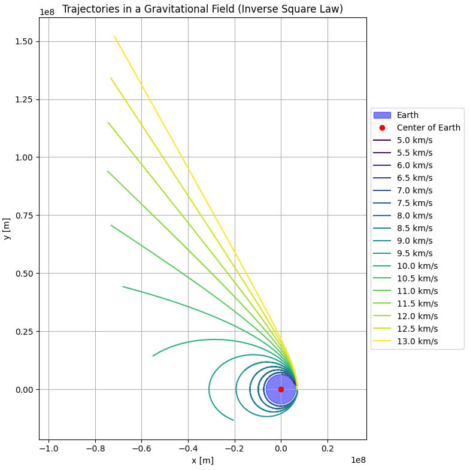
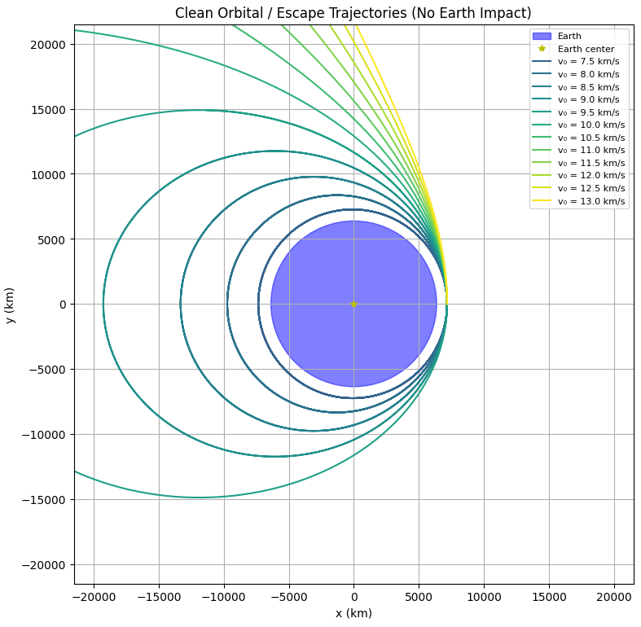

# Problem 3
# Payload Trajectories Near Earth

When a payload is released from a rocket near Earth, its path is governed by Newtonian gravity and initial conditions such as velocity, direction, and altitude. This document explores the types of trajectories possible—elliptical, parabolic, or hyperbolic—and simulates them using numerical integration.

## Physical Background

The gravitational force acting on a payload of mass $m$ due to the Earth (mass $M$) is given by Newton’s Law of Gravitation:

$$
\vec{F}_g = - \frac{G M m}{r^2} \hat{r}
$$

where:
- $G = 6.67430 \times 10^{-11} \ \text{m}^3\text{kg}^{-1}\text{s}^{-2}$ is the gravitational constant,
- $r$ is the distance from the center of the Earth,
- $\hat{r}$ is the unit vector pointing from the object to the Earth.

The motion of the payload can be determined by solving Newton's second law:

$$
\vec{a} = \frac{\vec{F}_g}{m} = - \frac{G M}{r^2} \hat{r}
$$

## Initial Conditions

- **Altitude**: 800 km above Earth's surface
- **Earth radius**: $R_E = 6371$ km
- **Initial position**: $\vec{r}_0 = (R_E + 800, 0)$ km
- **Initial velocities**: 5 to 13 km/s in the tangential (positive y) direction

## Trajectory Types

- **Elliptical orbit**: $v < v_{\text{escape}}$
- **Parabolic escape**: $v = v_{\text{escape}}$
- **Hyperbolic escape**: $v > v_{\text{escape}}$

Escape velocity from a distance $r$ is:

$$
v_{\text{escape}} = \sqrt{\frac{2 G M}{r}}
$$




## Python Simulation

The following Python code numerically integrates the motion using the Runge-Kutta method and plots the trajectory for various initial velocities. Earth is represented as a blue circle on the plot.

```python
import numpy as np
import matplotlib.pyplot as plt
from scipy.integrate import odeint

# === Constants ===
G = 6.67430e-11       # Gravitational constant (m^3 kg^-1 s^-2)
M = 5.972e24          # Earth mass (kg)
R_earth = 6371e3      # Earth radius (m)
mu = G * M            # Gravitational parameter (m^3 s^-2)

# === Launch Parameters ===
altitude = 800e3                      # Altitude above Earth's surface (m)
r0 = R_earth + altitude               # Initial distance from Earth's center (m)
x0, y0 = r0, 0                        # Launch from x-axis
v0_list = np.arange(5, 13.5, 0.5) * 1e3  # Speeds: 5 to 13 km/s

# Convert for plotting
R_earth_km = R_earth / 1e3
r0_km = r0 / 1e3

# === Gravity equations ===
def equations(state, t):
    x, y, vx, vy = state
    r = np.sqrt(x**2 + y**2)
    ax = -mu * x / r**3
    ay = -mu * y / r**3
    return [vx, vy, ax, ay]

# === Time array ===
t_max = 30000
t = np.linspace(0, t_max, 10000)

# === Plot setup ===
fig, ax = plt.subplots(figsize=(8, 8))
earth = plt.Circle((0, 0), R_earth_km, color='blue', alpha=0.5, label='Earth')
ax.add_patch(earth)
ax.plot(0, 0, 'y*', label='Earth center')

colors = plt.cm.viridis(np.linspace(0, 1, len(v0_list)))

# === Simulate and plot trajectories ===
for i, v0 in enumerate(v0_list):
    state0 = [x0, y0, 0, v0]  # Launch tangentially (along +y)

    solution = odeint(equations, state0, t)
    x_m = solution[:, 0]
    y_m = solution[:, 1]
    r_m = np.sqrt(x_m**2 + y_m**2)

    # If the projectile ever enters the Earth, skip the whole trajectory
    if np.any(r_m < R_earth):
        continue  # This one hit Earth, skip

    # Otherwise, plot the full clean trajectory
    x_km = x_m / 1e3
    y_km = y_m / 1e3
    ax.plot(x_km, y_km, color=colors[i], label=f'v₀ = {v0/1e3:.1f} km/s')

# === Final plot formatting ===
ax.set_xlim(-3 * r0_km, 3 * r0_km)
ax.set_ylim(-3 * r0_km, 3 * r0_km)
ax.set_xlabel('x (km)')
ax.set_ylabel('y (km)')
ax.set_title('Clean Orbital / Escape Trajectories (No Earth Impact)')
ax.set_aspect('equal')
ax.grid(True)
ax.legend(fontsize=8, loc='upper right')
plt.tight_layout()
plt.show()
```
# Colab #
[Colab Link](https://colab.research.google.com/drive/1UPn6MBFrlmQp4cqLCaJ4XPxoa8Iq_RWj?usp=sharing)