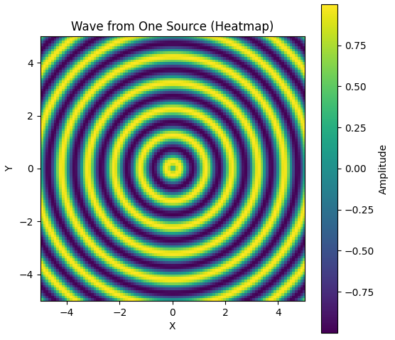
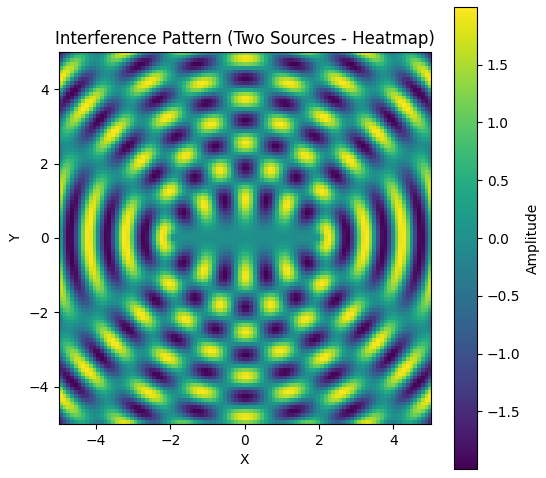

# Problem 1

# Wave Interference Solution

## Step 1: Select a Regular Polygon
Let's choose a square as the regular polygon, with vertices at coordinates $(0,0)$, $(1,0)$, $(1,1)$, and $(0,1)$. Each vertex will have a point source emitting waves.

## Step 2: Position the Sources
The sources are placed at the vertices of the square:
- Source 1: $(0,0)$
- Source 2: $(1,0)$
- Source 3: $(1,1)$
- Source 4: $(0,1)$

## Step 3: Wave Equations
Each source emits a wave with amplitude $A$, wavelength $\lambda$, frequency $f$, wave number $k = \frac{2\pi}{\lambda}$, and angular frequency $\omega = 2\pi f$. The wave from a source at $(x_i, y_i)$ to a point $(x, y)$ at time $t$ is given by:

- Distance from source to point: $r_i = \sqrt{(x - x_i)^2 + (y - y_i)^2}$
- Wave equation: $\eta_i(x, y, t) = \frac{A}{\sqrt{r_i}} \cos(k r_i - \omega t + \phi)$

Since all sources have the same phase, we set $\phi = 0$. Thus, for each source:
- Source 1 at $(0,0)$: $r_1 = \sqrt{x^2 + y^2}$, $\eta_1(x, y, t) = \frac{A}{\sqrt{r_1}} \cos(k r_1 - \omega t)$
- Source 2 at $(1,0)$: $r_2 = \sqrt{(x-1)^2 + y^2}$, $\eta_2(x, y, t) = \frac{A}{\sqrt{r_2}} \cos(k r_2 - \omega t)$
- Source 3 at $(1,1)$: $r_3 = \sqrt{(x-1)^2 + (y-1)^2}$, $\eta_3(x, y, t) = \frac{A}{\sqrt{r_3}} \cos(k r_3 - \omega t)$
- Source 4 at $(0,1)$: $r_4 = \sqrt{x^2 + (y-1)^2}$, $\eta_4(x, y, t) = \frac{A}{\sqrt{r_4}} \cos(k r_4 - \omega t)$

## Step 4: Superposition of Waves
The total displacement at point $(x, y)$ and time $t$ is the sum of the waves from all sources:

$\eta_{\text{sum}}(x, y, t) = \eta_1(x, y, t) + \eta_2(x, y, t) + \eta_3(x, y, t) + \eta_4(x, y, t)$

So,

$\eta_{\text{sum}}(x, y, t) = \frac{A}{\sqrt{r_1}} \cos(k r_1 - \omega t) + \frac{A}{\sqrt{r_2}} \cos(k r_2 - \omega t) + \frac{A}{\sqrt{r_3}} \cos(k r_3 - \omega t) + \frac{A}{\sqrt{r_4}} \cos(k r_4 - \omega t)$

## Step 5: Analyze Interference Patterns
- **Constructive Interference**: Occurs when the waves are in phase, i.e., the path difference $r_i - r_j$ is a multiple of $\lambda$. For example, at the center of the square $(0.5, 0.5)$, calculate $r_i$ from each source to check for constructive interference.
- **Destructive Interference**: Occurs when the waves are out of phase by $\pi$, i.e., the path difference is an odd multiple of $\frac{\lambda}{2}$. This can be observed along lines where waves cancel out.

## Step 6: Visualization
To visualize the interference patterns, use Python with Matplotlib to plot the total displacement $\eta_{\text{sum}}(x, y, t)$ over a 2D grid at a fixed time $t$. A heatmap or contour plot can illustrate regions of constructive and destructive interference effectively.

```python
import numpy as np
import matplotlib.pyplot as plt
import plotly.graph_objects as go
from matplotlib import animation
from IPython.display import HTML
def create_wave(x, y, source_x, source_y, amplitude, wavelength, time, speed):
  """Creates a wave from a single source."""
  distance = np.sqrt((x - source_x)**2 + (y - source_y)**2)
  wave = amplitude * np.sin(2 * np.pi * (distance / wavelength - time * speed / wavelength))
  return wave

# Define parameters
grid_size = 100
x = np.linspace(-5, 5, grid_size)
y = np.linspace(-5, 5, grid_size)
X, Y = np.meshgrid(x, y)

source_x, source_y = 0, 0
amplitude = 1
wavelength = 1
speed = 1
time = 0

# Generate wave data
wave_data = create_wave(X, Y, source_x, source_y, amplitude, wavelength, time, speed)

# Plotting (Heatmap)
plt.figure(figsize=(6, 6))
plt.imshow(wave_data, extent=[-5, 5, -5, 5], origin='lower', cmap='viridis')
plt.title('Wave from One Source (Heatmap)')
plt.xlabel('X')
plt.ylabel('Y')
plt.colorbar(label='Amplitude')
plt.show()

# Plotting (3D)
fig = go.Figure(data=[go.Surface(z=wave_data, x=x, y=y, colorscale='viridis')])
fig.update_layout(title='Wave from One Source (3D)',
                  scene = dict(
                      xaxis_title='X',
                      yaxis_title='Y',
                      zaxis_title='Amplitude'))
fig.show()
```


```python
def create_interference(x, y, sources, amplitude, wavelength, time, speed):
  """Creates interference pattern from multiple sources."""
  total_wave = np.zeros_like(x)
  for source_x, source_y in sources:
    total_wave += create_wave(x, y, source_x, source_y, amplitude, wavelength, time, speed)
  return total_wave

# Define parameters for two sources
sources_two = [( -2, 0), (2, 0)] # Source positions
time = 0

# Generate interference data
interference_data_two = create_interference(X, Y, sources_two, amplitude, wavelength, time, speed)

# Plotting (Heatmap)
plt.figure(figsize=(6, 6))
plt.imshow(interference_data_two, extent=[-5, 5, -5, 5], origin='lower', cmap='viridis')
plt.title('Interference Pattern (Two Sources - Heatmap)')
plt.xlabel('X')
plt.ylabel('Y')
plt.colorbar(label='Amplitude')
plt.show()

# Plotting (3D)
fig = go.Figure(data=[go.Surface(z=interference_data_two, x=x, y=y, colorscale='viridis')])
fig.update_layout(title='Interference Pattern (Two Sources - 3D)',
                  scene = dict(
                      xaxis_title='X',
                      yaxis_title='Y',
```



# Colab #
[Colab Link](https://colab.research.google.com/drive/10fIBZ2KBNwB4ymA9QLGwyIqgCLgBWuNd?usp=sharing)
