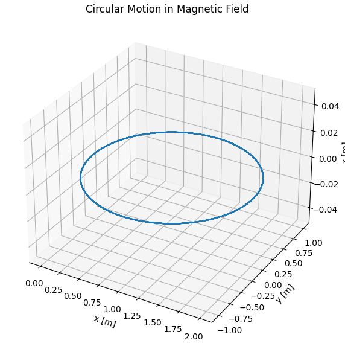
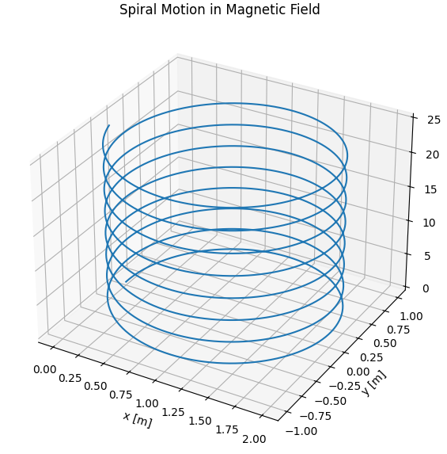
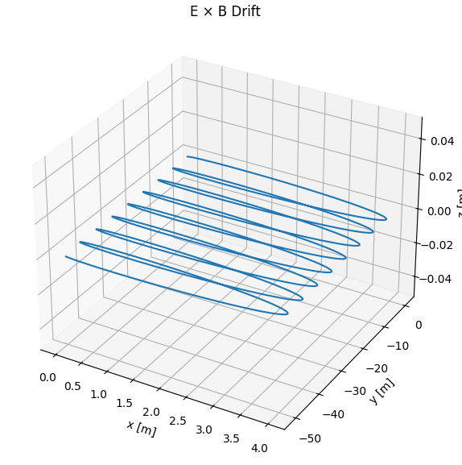

# Problem 1
#  Electromagnetism: Lorentz Force Simulations

##  Introduction

The Lorentz force describes the force exerted on a charged particle moving through electric and magnetic fields. It is given by:

$$
\vec{F} = q (\vec{E} + \vec{v} \times \vec{B})
$$

Where:
- \( \vec{F} \) is the force on the particle (in newtons, N),
- \( q \) is the electric charge of the particle (in coulombs, C),
- \( \vec{E} \) is the electric field (in volts per meter, V/m),
- \( \vec{v} \) is the velocity of the particle (in meters per second, m/s),
- \( \vec{B} \) is the magnetic field (in teslas, T).

This force is fundamental in understanding the motion of charged particles in electromagnetic fields, leading to various trajectory patterns depending on the initial conditions and field configurations.

---

##  Simulation Setup

We will simulate the motion of a charged particle under different electromagnetic field configurations using Python. The simulations will cover:

1. **Circular Motion**: Particle moving perpendicular to a uniform magnetic field.



2. **Spiral Motion**: Particle with an initial velocity component along the magnetic field.



3. **E×B Drift**: Particle in crossed electric and magnetic fields.



### Parameters

- **Charge**: \( q = 1\, \text{C} \)
- **Mass**: \( m = 1\, \text{g} = 0.001\, \text{kg} \)
- **Time Span**: \( t \in [0, 0.05]\, \text{s} \)
- **Time Steps**: 1000

---

##  Python Code

```python
import numpy as np
import matplotlib.pyplot as plt
from mpl_toolkits.mplot3d import Axes3D
from scipy.integrate import solve_ivp

# Constants
q = 1.0          # charge [C]
m = 0.001        # mass [kg]
B = np.array([0, 0, 1])  # Magnetic field [T]
E = np.array([0, 0, 0])  # Default: no electric field

# Lorentz Force Equation
def lorentz_force(t, state, E, B):
    r = state[0:3]
    v = state[3:6]
    a = (q/m) * (E + np.cross(v, B))
    return np.concatenate((v, a))

# Plotting function
def plot_trajectory(sol, title='Trajectory'):
    fig = plt.figure(figsize=(10, 7))
    ax = fig.add_subplot(111, projection='3d')
    ax.plot(sol.y[0], sol.y[1], sol.y[2])
    ax.set_title(title)
    ax.set_xlabel('x [m]')
    ax.set_ylabel('y [m]')
    ax.set_zlabel('z [m]')
    ax.grid(True)
    plt.show()

# Time settings
t_span = (0, 0.05)
t_eval = np.linspace(*t_span, 1000)

### 1. Circular Trajectory (vx ≠ 0, vy = vz = 0), B field only ###
v0 = np.array([0, 1e3, 0])   # Initial velocity
r0 = np.array([0, 0, 0])     # Initial position
state0 = np.concatenate((r0, v0))
sol1 = solve_ivp(lorentz_force, t_span, state0, t_eval=t_eval, args=(E, B))
plot_trajectory(sol1, title='Circular Motion in Magnetic Field')

### 2. Spiral Trajectory (add vz) ###
v0 = np.array([0, 1e3, 500])  # z-component causes spiral
state0 = np.concatenate((r0, v0))
sol2 = solve_ivp(lorentz_force, t_span, state0, t_eval=t_eval, args=(E, B))
plot_trajectory(sol2, title='Spiral Motion in Magnetic Field')

### 3. Drift in E x B Field ###
E = np.array([1000, 0, 0])   # Electric field in x
B = np.array([0, 0, 1])      # Magnetic field in z
v0 = np.array([0, 1e3, 0])   # Perpendicular velocity
state0 = np.concatenate((r0, v0))
sol3 = solve_ivp(lorentz_force, t_span, state0, t_eval=t_eval, args=(E, B))
plot_trajectory(sol3, title='E × B Drift')
```

***Colab***

 [Colab Link](https://colab.research.google.com/drive/1VRe8eJ75J-PFvNOQj2IY8NAdAahzKjw7?usp=sharing)
