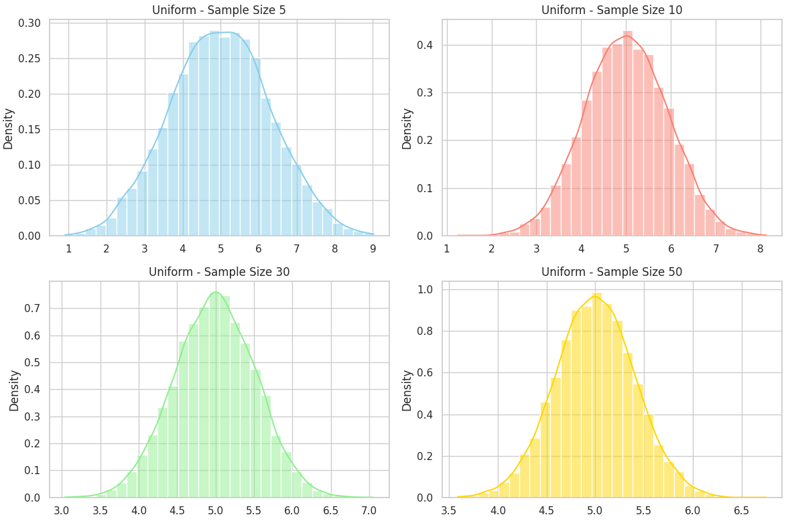
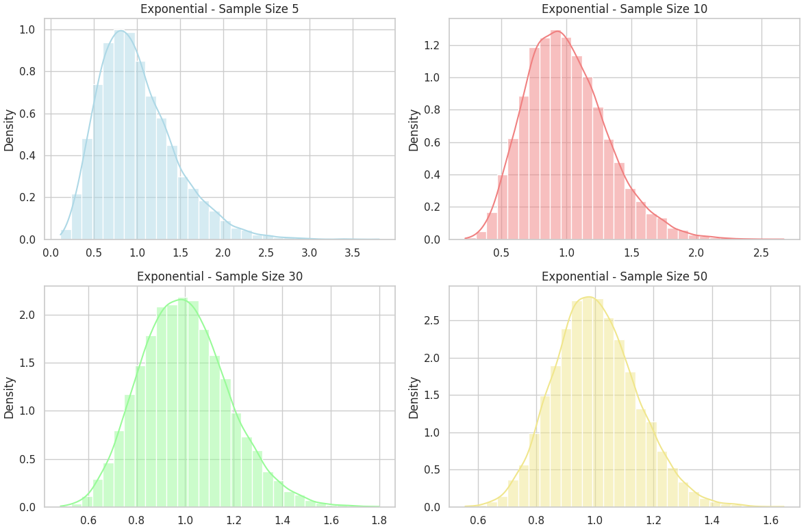
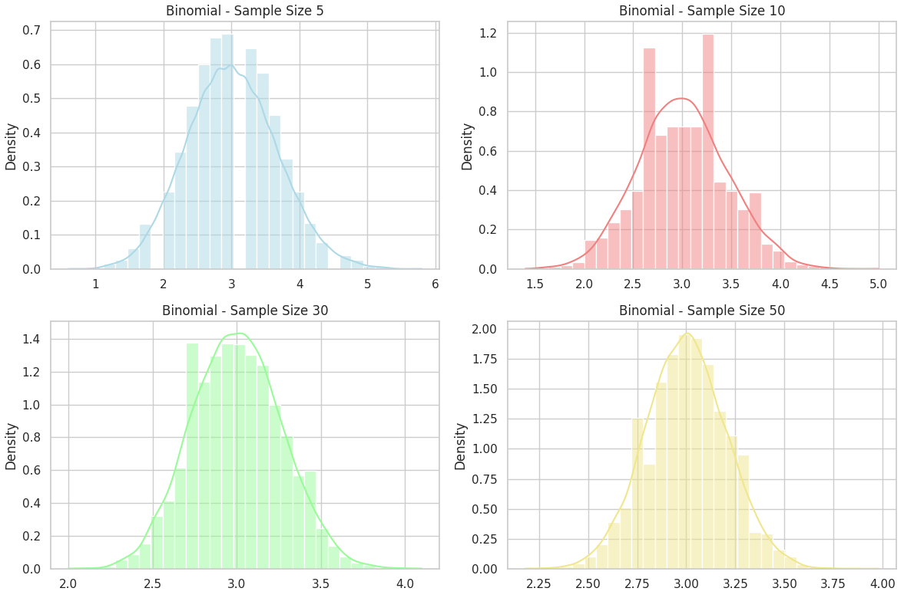

# Problem 1

#  Exploring the Central Limit Theorem (CLT) Through Simulation

##  Objective

To understand and visualize how the **Central Limit Theorem** (CLT) works in practice using simulation techniques on different types of population distributions.

---

##  What is the Central Limit Theorem?

The **Central Limit Theorem (CLT)** is a fundamental theorem in probability and statistics. It states:

> If you take sufficiently large random samples from any population with a finite mean ($\mu$) and finite variance ($\sigma^2$), the distribution of the sample means will approach a **normal distribution**, regardless of the shape of the population distribution.

### Mathematical Formulation

Let $X_1, X_2, \dots, X_n$ be independent and identically distributed random variables with:

- Mean: $\mu$
- Variance: $\sigma^2$

Then the **sample mean**:

$$
\bar{X}_n = \frac{1}{n} \sum_{i=1}^{n} X_i
$$

approaches a normal distribution:

$$
\bar{X}_n \sim \mathcal{N} \left( \mu, \frac{\sigma^2}{n} \right)
$$

as $n \rightarrow \infty$.

---

## Distributions Used in This Simulation

We explore the CLT using three distinct population distributions:

| Distribution Type | Description                              | Shape          |
|-------------------|------------------------------------------|----------------|
| **Uniform**       | Evenly distributed between [0, 1]         | Symmetric      |
| **Exponential**   | Decaying probability, positive values only| Skewed (Right) |
| **Binomial**      | Discrete counts of successes in trials    | Varies (Symmetric if $p=0.5$) |

---
 ## Uniform Distribution

  


## Exponential Distribution



## Binomial Distribution



```python
import numpy as np
import matplotlib.pyplot as plt
import seaborn as sns

# Set style for the plots
sns.set(style="whitegrid")

def simulate_sample_means(distribution_func, sample_sizes, num_samples=10000):
    """
    Simulates sample means for different sample sizes.

    Parameters:
        distribution_func: function that generates samples (e.g., np.random.uniform)
        sample_sizes: list of sample sizes to test
        num_samples: how many times to repeat sampling

    Returns:
        Dictionary mapping sample_size -> list of sample means
    """
    results = {}
    for n in sample_sizes:
        sample_means = []
        for _ in range(num_samples):
            # Generate a sample from the specified distribution
            sample = distribution_func(size=n)
            # Calculate the mean of the sample
            sample_mean = np.mean(sample)
            # Store the sample mean
            sample_means.append(sample_mean)
        results[n] = sample_means
    return results

# Define the population distribution: Uniform between [0, 10]
def generate_uniform(size):
    return np.random.uniform(0, 10, size=size)

# Define the sample sizes to simulate
sample_sizes = [5, 10, 30, 50]

# Simulate sample means for the uniform distribution
uniform_data = simulate_sample_means(generate_uniform, sample_sizes)

# Create a figure and subplots to display the histograms
fig, axes = plt.subplots(2, 2, figsize=(12, 8))

# Plot histograms of the sample means for each sample size
for ax, n in zip(axes.flat, sample_sizes):
    sns.histplot(uniform_data[n], ax=ax, kde=True, stat="density", bins=30)
    ax.set_title(f"Uniform - Sample Size {n}")

# Adjust layout for better spacing
plt.tight_layout()

# Display the plot
plt.show()
```
##  Simulation Process


For each population distribution, we follow this procedure:

1. **Generate a large population** of size $N = 100,\!000$.
2. **Sample multiple times** from this population using sample sizes:
   - $n = 5, 10, 30, 50$
3. **Repeat each sampling 1000 times** to create a distribution of sample means.
4. **Plot histograms** of these sample means to observe the distribution shape.
5. **Compare results across sample sizes** to see convergence to normality.

---

##  What We Expect to Observe

- For **small sample sizes**, the distribution of sample means may resemble the shape of the population.
- As the **sample size increases**, the distribution of sample means becomes **more bell-shaped and symmetric**.
- The **spread** (standard deviation) of the sample mean **shrinks** as sample size increases:

$$
\sigma_{\bar{x}} = \frac{\sigma}{\sqrt{n}}
$$

---

##  Key Definitions

| Term                 | Meaning                                                                 |
|----------------------|-------------------------------------------------------------------------|
| **Population**       | The entire dataset from which samples are drawn                         |
| **Sample**           | A subset of the population                                              |
| **Sample Mean**      | The average value of a sample                                           |
| **Sampling Distribution** | Distribution of sample means over many samples of the same size   |
| **Standard Error**   | Standard deviation of the sample mean, $\sigma / \sqrt{n}$             |

---

##  Why CLT Is So Important

- **Foundational for inferential statistics**: It allows us to use sample statistics to infer population parameters.
- **Enables confidence intervals** and **hypothesis testing**.
- **Provides justification** for using the normal distribution in many practical applications, even when data isn't normal.

---

##  Real-World Applications

###  Manufacturing & Quality Control
Monitor average product measurements (e.g., bolt diameter) to detect process issues.

###  Business Analytics
Use sample survey data to estimate market preferences.

###  Finance
Model portfolio returns — CLT helps justify assumptions of normality in asset returns.

###  Healthcare
Analyze average response times or treatment outcomes from clinical trials.

---

##  Summary

- The CLT shows how **random variation averages out** over many samples.
- Even for **non-normal populations**, the **mean of many samples becomes normal**.
- This allows reliable estimation of population parameters using normal-based techniques.

---
### Colab
https://colab.research.google.com/drive/1zb1_0HUP0-2ykWkjjA-NkAFgA_OBmLtH?usp=sharing

