# Problem 2

#  Estimating π Using Monte Carlo Methods

##  Motivation

Monte Carlo simulations are a powerful class of computational techniques that use randomness to solve problems or estimate values. One elegant and visual application is the estimation of π.

By simulating random processes like dart throws or needle drops, we can connect **geometry**, **probability**, and **numerical methods** into a hands-on approach that deepens our understanding of how randomness can be harnessed to estimate complex values like π.

---

##  PART 1: Estimating π Using a Circle

###  1. Theoretical Foundation

We consider a **unit circle** (radius = 1) inscribed inside a **square** of side length 2.

- Area of the circle: $A_{\text{circle}} = \pi r^2 = \pi$
- Area of the square: $A_{\text{square}} = (2r)^2 = 4$

Now, randomly generate points inside the square. The **probability** that a point falls inside the circle is proportional to the area:

$$
\frac{\text{Points inside circle}}{\text{Total points}} \approx \frac{\pi}{4}
$$

So, we estimate π as:

$$
\pi \approx 4 \times \frac{\text{Points inside circle}}{\text{Total points}}
$$

---

###  2. Simulation Steps

1. Generate $N$ random points $(x, y)$ in the square $[0, 1] \times [0, 1]$
2. Count how many satisfy: $x^2 + y^2 \leq 1$
3. Estimate π using the formula above

---

###  3. Visualization

- Plot all generated points
- Use blue for points **inside** the circle
- Use red for points **outside**

This visualizes how the proportion relates to π.

---

###  4. Analysis

As $N$ increases:

- The estimate becomes more accurate.
- The error decreases proportionally to $1/\sqrt{N}$.
- Plotting π estimates against number of points shows convergence.

---
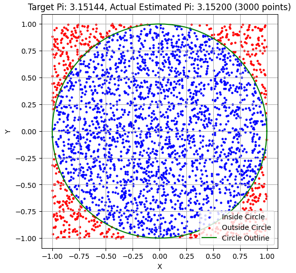

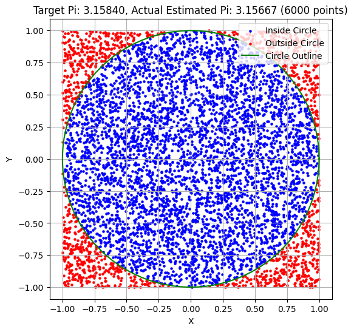

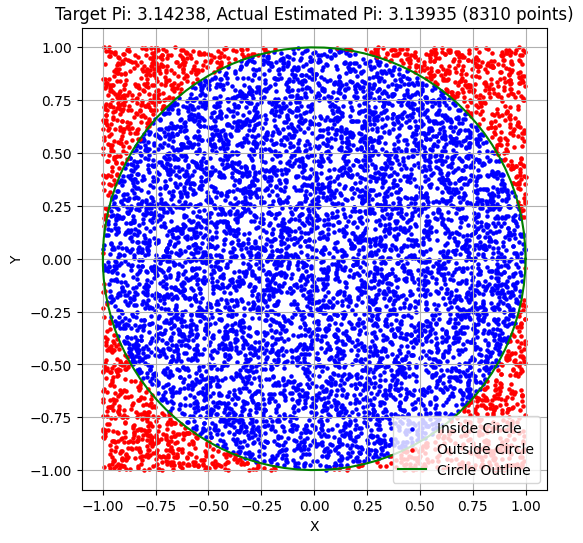

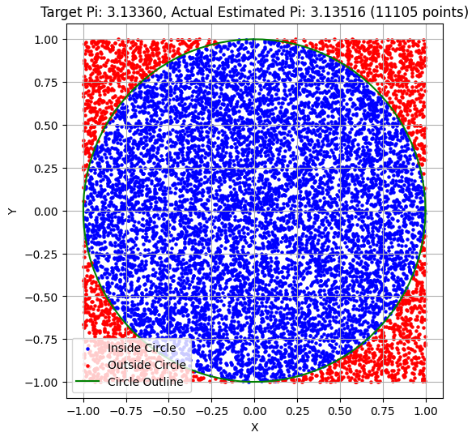

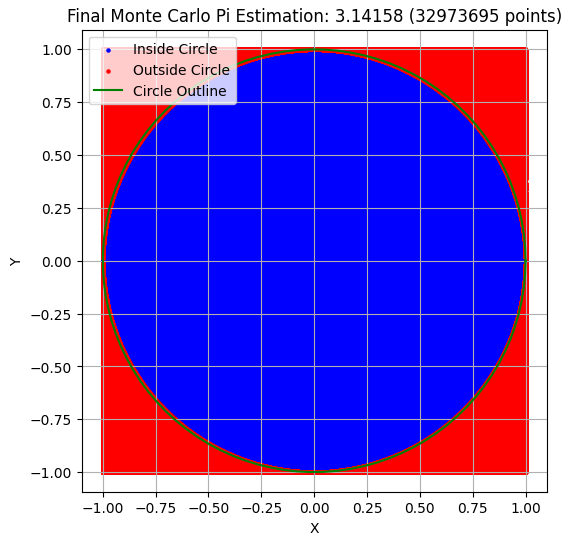

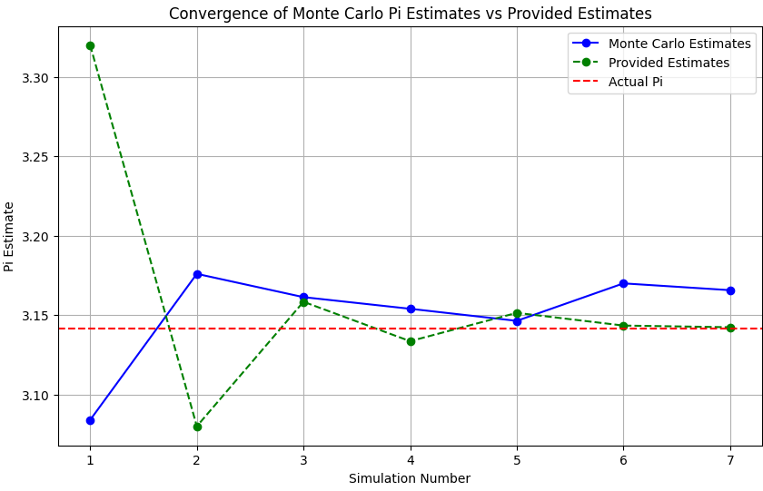
##  PART 2: Estimating π Using Buffon’s Needle

###  1. Theoretical Foundation

**Buffon's Needle** is a classic probability experiment:

- A floor is marked with parallel lines a distance $d$ apart.
- A needle of length $l \leq d$ is dropped randomly.
- We calculate the probability $P$ that the needle crosses a line.

The probability of crossing is:

$$
P = \frac{2l}{\pi d}
$$

Rearranging gives an estimator for π:

$$
\pi \approx \frac{2lN}{dC}
$$

Where:

- $N$ = number of needle drops
- $C$ = number of times the needle crosses a line

---

###  2. Simulation Steps

1. Drop $N$ needles:
   - Random center position from line: $x \in [0, d/2]$
   - Random angle: $\theta \in [0, \pi/2]$
2. A crossing occurs if:
   $$
   x \leq \frac{l}{2} \sin(\theta)
   $$
3. Count crossings and estimate π

###  3. Visualization

- Draw horizontal lines spaced $d$ units apart
- Plot each needle segment
- Highlight those that cross a line
---
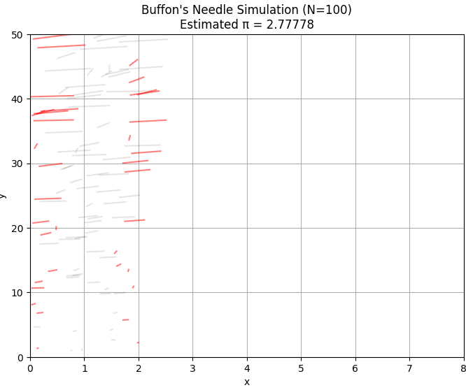

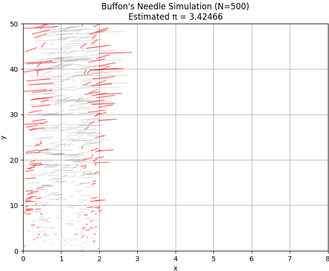

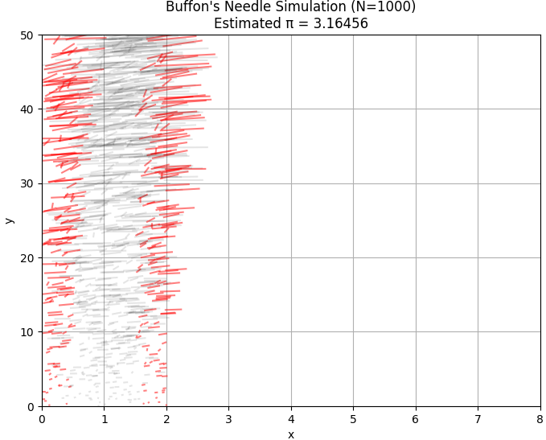

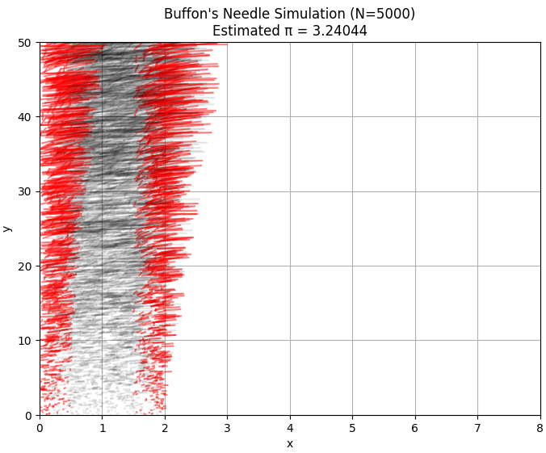


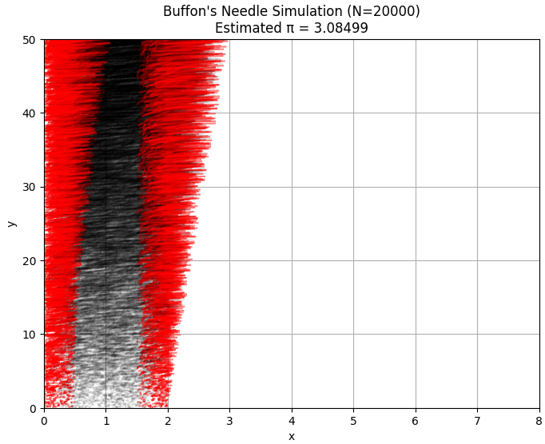

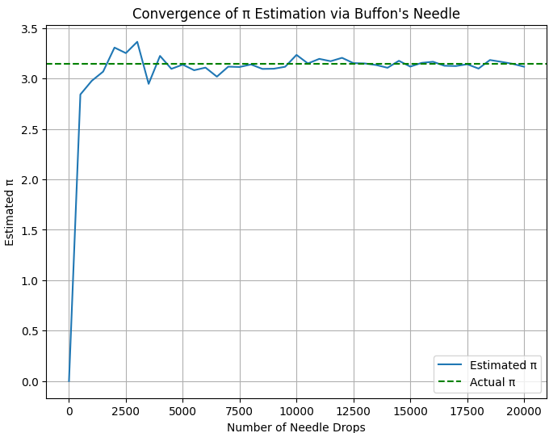

```python
import matplotlib.pyplot as plt
import numpy as np
import math

# Parameters
L = 1.0  # Length of the needle
d = 2.0  # Distance between lines
N_values = [100, 500, 1000, 5000, 10000, 20000]  # Number of needle drops

for N in N_values:
    # Simulate needle drops
    hits = 0
    x_coords = []
    y_coords = []
    angles = []
    crosses_line = []

    for _ in range(N):
        x = np.random.uniform(0, d)
        y = np.random.uniform(0, 50)
        theta = np.random.uniform(0, math.pi / 2)
        x_coords.append(x)
        y_coords.append(y)
        angles.append(theta)
        
        # Check if needle crosses a line
        if x + (L * math.sin(theta) / 2) >= d or x - (L * math.sin(theta) / 2) <= 0:
            hits += 1
            crosses_line.append(True)
        else:
            crosses_line.append(False)
    
    # Estimate π
    pi_est = (2 * L * N) / (d * hits) if hits > 0 else 0
    
    # Plot needles
    plt.figure(figsize=(8, 6))
    for i in range(N):
        x_end = x_coords[i] + L * math.cos(angles[i]) * (y_coords[i] / 50)
        y_end = y_coords[i] + L * math.sin(angles[i]) * (y_coords[i] / 50)
        color = 'r' if crosses_line[i] else 'k'
        alpha = 0.5 if crosses_line[i] else 0.1
        plt.plot([x_coords[i], x_end], [y_coords[i], y_end], color=color, alpha=alpha)
    
    plt.title(f"Buffon's Needle Simulation (N={N})\nEstimated π = {pi_est:.5f}")
    plt.xlabel("x")
    plt.ylabel("y")
    plt.grid(True)
    plt.ylim(0, 50)
    plt.xlim(0, 8)
    plt.show()

# Convergence plot
pi_estimates = []
for N in range(0, 20001, 500):
    hits = 0
    for _ in range(N):
        x = np.random.uniform(0, d)
        theta = np.random.uniform(0, math.pi / 2)
        if x + (L * math.sin(theta) / 2) >= d or x - (L * math.sin(theta) / 2) <= 0:
            hits += 1
    pi_est = (2 * L * N) / (d * hits) if hits > 0 else 0
    pi_estimates.append(pi_est)

plt.figure(figsize=(8, 6))
plt.plot(range(0, 20001, 500), pi_estimates, label="Estimated π")
plt.axhline(y=math.pi, color='g', linestyle='--', label="Actual π")
plt.title("Convergence of π Estimation via Buffon's Needle")
plt.xlabel("Number of Needle Drops")
plt.ylabel("Estimated π")
plt.legend()
plt.grid(True)
plt.show()
```
---

###  4. Analysis

- Buffon’s method is slower to converge than the circle method
- More sensitive to random variation (especially for small $N$)
- Useful to demonstrate geometric probability in a physical context

---

##  Comparison Table

| Method           | Conceptual Basis | Convergence Speed | Visualization | Real-World Intuition      |
|------------------|------------------|-------------------|----------------|----------------------------|
| Circle-based     | Geometric Area   | Fast              | Simple         | Like throwing darts       |
| Buffon’s Needle  | Geometric Probability | Slower        | More complex   | Like dropping matchsticks |

---

##  Summary

- Monte Carlo methods demonstrate how **randomness** can estimate mathematical constants.
- Both methods rely on **probabilistic geometry** and **law of large numbers**.
- Estimations converge to π as number of trials increases.

###  Key Formulas

- Circle Method: $\pi \approx 4 \times \frac{\text{Points inside circle}}{\text{Total points}}$
- Buffon’s Needle: $\pi \approx \frac{2lN}{dC}$

---

##  Try More

- Increase sample sizes to compare convergence rates
- Simulate in 3D (volume vs. sphere)
- Vary needle length in Buffon’s Needle

---

##  References

- Monte Carlo Methods in Python — [NumPy Docs](https://numpy.org/doc/)
- Buffon’s Needle — [Wikipedia](https://en.wikipedia.org/wiki/Buffon%27s_needle)
- Geometry and Probability — D. Feller, *An Introduction to Probability Theory*

## Colab
[Colab Link]https://colab.research.google.com/drive/1Uuri4PqgJ21uW_h7lJ8sVxfgRmS-moN9?usp=sharing